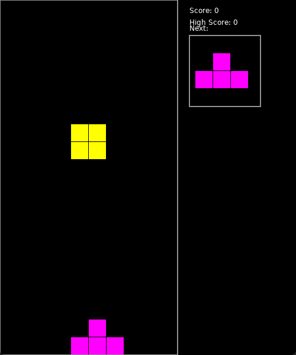

# Tetris-of-Color

一个使用 LÖVE2D 框架开发的彩色俄罗斯方块游戏。



## 功能特点

- 七种不同形状的方块，每种都有独特的颜色
- 清行计分系统
- 下一个方块预览
- 高分记录保存
- 平滑的方块旋转
- 支持快速下落

## 操作方式

- **←/→**: 左右移动方块
- **↑**: 旋转方块
- **↓**: 加速下落
- **空格**: 直接落底
- **R**: 游戏结束时重新开始

## 安装说明

### 前置要求

- [LÖVE2D](https://love2d.org/) 11.4 或更高版本

### 运行方法

1. 克隆此仓库：

```bash
git clone https://github.com/BruceBlink/Tetris-of-Color-love.git
```

2. 进入项目目录：

```bash
cd Tetris-of-Color
```

3. 运行游戏：

```bash
love .
```

## 项目结构

```text
Tetris-of-Color-love/
├── main.lua          # 主游戏代码
├── icon.png          # 游戏图标
├── screenshot.gif    # 游戏截图
└── README.md         # 说明文档
```

## 评分系统

- 单行消除：100 分
- 多行同时消除会获得额外奖励
- 比如同时消除两行：400 分 (2 _100_ 2)
- 同时消除三行：900 分 (3 _100_ 3)
- 同时消除四行：1600 分 (4 _100_ 4)

## 贡献指南

欢迎提交 Pull Request 来改进游戏！建议的改进方向：

1. 添加音效
2. 实现本地存档功能
3. 添加不同难度级别
4. 优化游戏界面
5. 添加更多特效

## 开源协议

本项目采用 MIT 协议开源，详见 [LICENSE](LICENSE) 文件。

## 致谢

- [LÖVE2D](https://love2d.org/) 框架
- 经典俄罗斯方块游戏的启发

## 联系方式

如有问题或建议，欢迎：

提交 Issue

## 更新日志

### v1.0.0 (2024-04-09)

- 初始版本发布
- 实现基本游戏功能
- 添加分数系统
- 添加下一个方块预览
